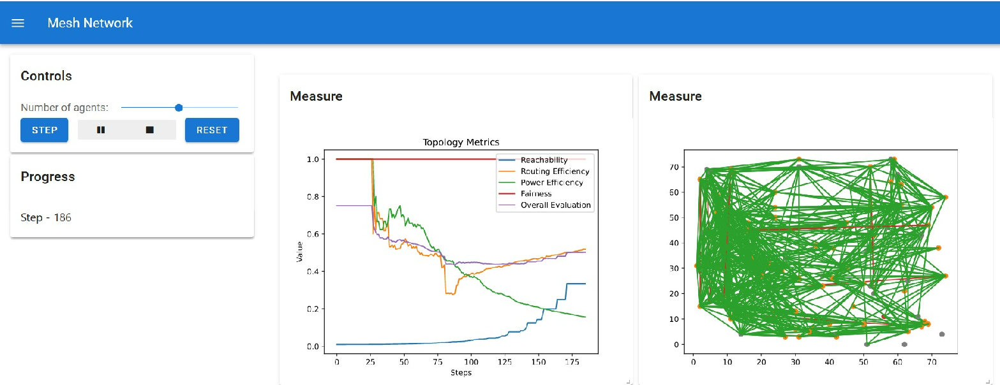

# Mesh Simulator

To run the simulator, Python 3.10 or higher is required. You can install the simulator with pip:

```bash
pip install git+https://github.com/coffee2toast/mesh-simulator.git
```

To run the simulator, due to a limitation in solara, you need to download the `__main__.py` file from the repository and run it with Python:

```bash
curl https://raw.githubusercontent.com/coffee2toast/mesh-simulator/main/src/mesh_simulator/__main__.py -o mesh_simulator.py
solara run mesh_simulator.py
```

Your browser will open, where you will be able to interact with the simulator:



## License

MIT
